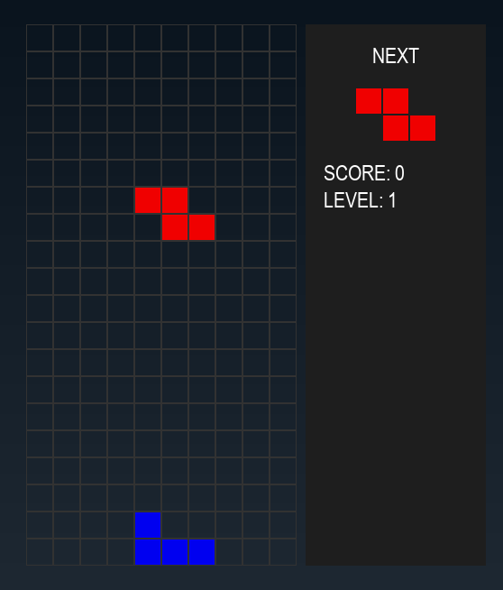

Here's a comprehensive `README.md` file for your Tetris game project:

```markdown
# 🎮 Python Tetris Game

A classic Tetris implementation using Pygame with modern visuals and smooth gameplay.

 *(Replace with actual screenshot later)*

## 🚀 Features

- 🎨 Modern graphics with colorful blocks
- ⏬ Smooth falling piece mechanics
- 🔄 Piece rotation system
- 👀 Next piece preview
- 📊 Score and level tracking
- 🎮 Keyboard controls
- 💥 Game over detection

## 📋 Requirements

- Python 3.8+
- Pygame 2.6.1+

## ⚙️ Installation

1. Clone the repository:
   ```bash
   git clone https://github.com/aleaengineer/python-tetris.git
   cd python-tetris
   ```

2. Install dependencies:
   ```bash
   pip install -r requirements.txt
   ```

## 🕹️ How to Play

### Controls:
- **← →** : Move piece left/right
- **↓** : Move piece down faster
- **↑** : Rotate piece
- **Space** : Hard drop (instant drop)
- **R** : Restart game when game over

### Game Rules:
- Clear lines to earn points
- Game speeds up as you level up
- Game ends when pieces stack to the top

## 📂 File Structure

```
python-tetris/
├── main.py            # Main game code
├── requirements.txt   # Dependencies
└── README.md          # This file
```

## 🛠️ Customization

You can easily modify:
- Colors in `COLORS` list
- Game speed by adjusting `fall_speed`
- Grid size by changing `GRID_WIDTH` and `GRID_HEIGHT`
- Block size with `BLOCK_SIZE`

## 🤝 Contributing

Contributions are welcome! Please open an issue or PR for any:
- Bug fixes
- New features
- Improvements

## 📜 License

MIT License - Feel free to use and modify this code

---
